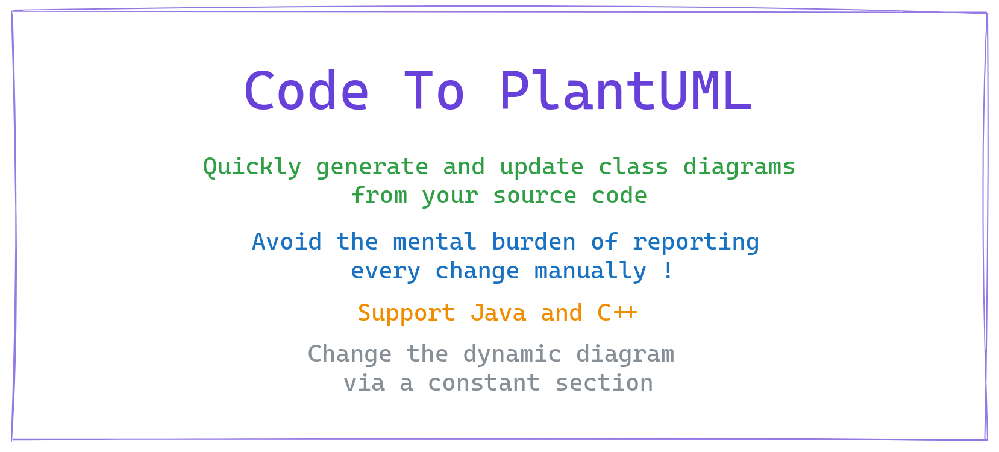

# ctp



```sh
$ ctp
CTP - Code To PlantUML

Usage: ctp [lang] [path] [output]

Available langs: java | cpp
Path: a path to a folder inside the current directory
Output: the name of resulting diagram file (generally in .puml)

Examples:
ctp cpp src diagram.puml
ctp cpp . classdiagram.plantuml
ctp java app/src/main/org/example/stack stack.puml
```

TODO: examples with current codebase

## Introduction
**Status**  
I don't plan to maintain this project, I want to "just make it work" and will not expand it further. But I'm happy to document how to use it and how it works in case it's useful to someone else in my class or outside. I guess a lot of IT students are learning and need to have up-to-date UML diagrams... If you want to do other changes or support other languages, feel free to fork the project and continue on your own :)

## License
The code present in this repository is released under [MIT](LICENSE). The licenses of supported generators is independent of this license as we are running the generators as separated CLIs (they are separated processes, ctp is just a glue around it to easily run them).

## Supported languages
I support languages when I need it. When I found the best generator, as it generally works for 95% of my needs, I do a fork to adapt it. Then I integrate them here, so they can be easily ran and support post-processing features.

### Java
- Fork of generator: https://github.com/samuelroland/plantuml-parser
- Modifications: see README of given repos
- License: [Apache-2.0](https://github.com/samuelroland/plantuml-parser/blob/main/LICENSE)
- Note: Thanks a lot to @shuzijun for your effort in making in this nice tool, this got me started with this repository !

### Python
- Fork of generator: https://github.com/samuelroland/hpp2plantuml
- Modifications: see README of given repos
- License: [MIT](https://github.com/samuelroland/hpp2plantuml/blob/master/LICENSE) - Copyright (c) 2016 T
- Note: Thanks a lot to @thibaultmarin for this nice converter, it works pretty well !

**TODO**

## How to setup
*I know this is not a straightforward setup but is the best I can do in the short time I invest in this mini project...*
1. Clone the repository
   ```sh
   git clone git@github.com:samuelroland/ctp.git
   ```
1. Build the Docker image
   ```sh
    docker build -t ctp .
   ```
1. Run the CLI
   Note: We mount the current folder to `/cli/code` in container, to give it access to the current folder. Therefore, the given path (first argument) needs to be 
    ```
    docker run -v .:/cli/code ctp
    ```
1. Instead of typing `docker run -v .:/cli/code ctp` everytime I recommend to setup an alias like this. You can persist this alias in your shell config (i.e. `.bashrc`)
    ```sh
    alias ctp="docker run -v .:/cli/code ctp"
    ```
    You can now just run 
    ```sh
    ctp src/main diagram.puml
    ```
See more options and usage below.

## Advanced usage

<!-- Optionally, if you need to customize your schema, here is how you can do it.

**TODO**

To see all possible options of the underlying parser CLI:
```sh
ctp parserhelp
``` -->

**Static part**  
Once you generate your diagram once, you probably want to make some small changes like adding associations (as they are not automatically generated sadly). If you directly edit your schema, you will lose your changes during next schema generation because the file is just erased each time. I defined a *static section* in generated file, a section that is not erased during regeneration and can contain special actions on the dynamic part.

At the end of the schema you should find this section starting with `' STATIC` and ending in `' ENDSTATIC`. You can safely add uncommented lines for the first 2 parts. You probably noticed the `' REMOVE` line, after this you can add regex patterns that will be **removed** in the above text. For example to remove a line like `- currentTime: Time` you could write `' .*: Time\n`. These lines must be commented so they are not part of the schema ! This is particularly useful to remove some lines related to missing associations you manually added !
```
' STATIC
' Style

' Missing associations

' Post operations
' REMOVE

' ENDSTATIC
```

TODO: Checkout the example 

TODO: Implement EDIT keyword to easily do search and replace

## How it works

**High level steps overview:**
1. Check CLI args and show errors if needed
1. The output file is a ".tmp" variant not exactly the one given as second arg
1. If lang is java
   1. Call `plantuml-parser-cli` with given arguments as -f and -o, with default params related to schema settings. 
1. If lang is cpp
   1. Call hpp2toplantuml ... TODO: document this
1. Run post operations via PostMix.java, read tmp file and possibly existing non tmp file
   1. Push the default section text at the start in case there is no existing non tmp file or no static section has been found
   1. Reuse the existing section, push it at the start, apply removal patterns.
   1. Save the final text in non tmp file

## How to update
In case this repository is updated, you can pull changes and do a rebuild
```sh
git pull
docker build -t ctp .
```

## How to uninstall
```sh
docker image rm ctp
# and remove your alias ctp
```