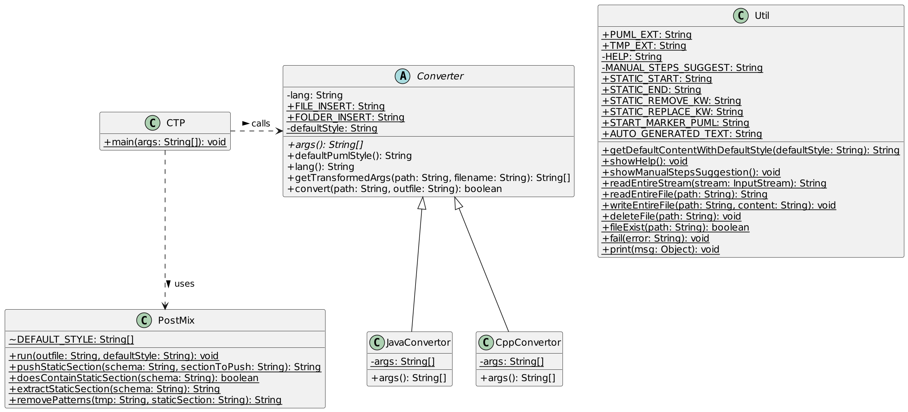

# ctp


```sh
$ ctp
CTP - Code To PlantUML - v0.1

Usage: ctp [lang] [path] [output]

Languages: java | cpp
Path: a path to a folder to scan (must be inside the current directory)
Output: the name of output diagram file (extension .puml is added if missing)

Examples:
ctp cpp src diagram
ctp cpp . classdiagram
ctp java app/src/main/org/example/stack stack
ctp java src/ project.puml

Repository: https://github.com/samuelroland/ctp
Docs: See README.md in repository
```

## Demo with current Java codebase
We have a folder structure with a few Java classes in `src`, the entrypoint is `CTP.java`
```
.
├── ...
└── src
   ├── Converter.java
   ├── CppConverter.java
   ├── CTP.java
   ├── JavaConverter.java
   ├── PostMix.java
   └── Util.java
```

By running `ctp java src diagram` it generates a `diagram.puml` file:


Then inside the static section we can make changes to the style, add missing associations. If we change the code (here we rename `Util.fail()` into `Util.error()`) we can safely regenerate the diagram the static section will be preserved !


See the generated file in [examples/ctp.puml](examples/ctp.puml) and [exported image](examples/ctp.png)



## Demo with a C++ codebase
I took a random C++ project we made at school, let's clone the repos and run CTP:
```
git clone https://github.com/HEIGVD-PRG1-F-2022/lab06-lastrobotstanding-roboto.git
cd lab06-lastrobotstanding-roboto
ctp cpp . diagram
```

It gives us this raw diagram


We want a title, scale the image, and add hidden links to rearrange the diagram. Let's do it inside the static section after the default style:
```diff
' Style
hide empty members
hide circle
skinparam classAttributeIconSize 0
+ scale 2
+ title LastRobotsStanding game

' Additions
+ RobotState "1"*--"1" Robot: manage info >
+ Game -[hidden]- Roboto
+ RobotPack -[hidden]- UpdatesPack

+ Robot <|-- Roboto
```

In generated diagram, we want to remove these 2 attributes and use 2 associations instead
```
class Game {
	- robots: std::vector<RobotState>
	- boni: std::vector<Bonus>
```

so we add these 2 unique patterns under `REMOVE` (those are external class in a dependency, this is why it is not in this schema)
```diff
' REMOVE
+ ' - robots: std::vector<RobotState>
+ ' - boni: std::vector<Bonus>
```
and we add the associations manually
```diff
' Additions
+ Game "1"-->"*" RobotState: manage >
+ Game "1"-->"*" Bonus: offer >
RobotState "1"*--"1" Robot: manage info >
Game -[hidden]- Roboto
RobotPack -[hidden]- UpdatesPack

Robot <|-- Roboto
```

We need to run generation again to have the remove patterns applied: `ctp cpp . diagram` and bam, the 2 lines have been removed, here is the final diagram.


Look at the source file if needed: [examples/cpp-example-2.puml](examples/cpp-example-2.puml)

## How to setup
*I know this is not a straightforward setup but is the best I can do in the short time I invest in this mini project...*
1. Clone the repository
   ```sh
   git clone git@github.com:samuelroland/ctp.git
   ```
1. Build the Docker image
   ```sh
   docker build -t ctp .
   ```
1. Run the CLI
   Note: We mount the current folder to `/code` in container, to give it access to the current folder. Therefore, the given path (first argument) needs to be 
    ```sh
    docker run -v .:/code ctp
    ```
1. Instead of typing `docker run -v .:/code ctp` every time, I recommend to setup a shell wrapper around it.
    1. With Fish, you can quickly install it: `gnfit ctp` [what's that ?](https://codeberg.org/samuelroland/productivity/src/branch/main/HEIG/tools/README.md)
    1. With Bash, you can persist this alias in your shell config (`~/.bashrc`).
    ```bash
    # Shell wrapper around the docker image named "ctp" and locally built from https://github.com/samuelroland/ctp
    function ctp() {
        # We need to create the output file before the container to set permission to $USER instead of root
        if test $# -ge 3; then
            name=$3
            if ! echo $name | grep .puml; then
                name="$name.puml"
            fi
            touch "$name"
        fi

        docker run -v .:/code ctp $@
    }
    ```
    You can now just run it, here is an example for a Java project with all classes inside src/main and an output diagram named diagram.puml.
    ```sh
    ctp java src/main diagram
    ```
1. Make sure to remove do the manual work after generation (remove existing incorrect/incomplete associations, add missing one, changing style, add notes, ...)

See more options and usage below.

**Warning: the CLI erase the latest diagram file, make sure you didn't change anything outside the static section or that you can recover it. Ex: `ctp java src/ project` will erase `project.puml` and `project.puml.tmp`.**

## Static section
Once you generate your diagram once, you probably want to make some small. If you directly edit your schema, you will lose your changes at next schema generation because the file is just erased each time. I defined a *static section* in generated file, meaning a section that is not erased during regeneration and can contain special actions on the dynamic part.

At the start of the schema you should find a marker `' STATIC` and an ending marker `' ENDSTATIC`. You can safely add lines inside. You probably noticed the `' REMOVE` line, after this you can add regex patterns (in comments so PlantUML don't consider them) that will be **removed** in the dynamic part. For example to remove a line like `- currentTime: Time` you could write `' - .*: Time\n`. This is particularly useful to remove some existing lines like associations you want to change !
```
' STATIC
' Generated by CTP - https://github.com/samuelroland/ctp

' Style
hide empty members
hide circle
skinparam classAttributeIconSize 0

' Additions

' REMOVE

' ENDSTATIC
```


## How it works

### Supported languages
I support languages when I need it. When I found the best converter, as it generally works for 95% of my needs, I do a fork to adapt it. Then I integrate them here, so they can be easily ran and support post-processing features. **converters are far from being perfect, they don't support some modern syntax and do don't generate associations**.

Note: you don't need to install these converters, they are bundle in CTP. The links are only useful if you want to change the behavior of these converters or see my changes.

#### Java
- Fork of converter: https://github.com/samuelroland/plantuml-parser
- Modifications: see README of given repos
- License: [Apache-2.0](https://github.com/samuelroland/plantuml-parser/blob/main/LICENSE)
- Note: Thanks a lot to @shuzijun for your effort in making in this nice tool, this got me started with this little project !

#### Python
- Fork of converter: https://github.com/samuelroland/hpp2plantuml
- Modifications: see README of given repos
- License: [MIT](https://github.com/samuelroland/hpp2plantuml/blob/master/LICENSE) - Copyright (c) 2016 T
- Note: Thanks a lot to @thibaultmarin for this nice converter, it's really useful !
- They are known bugs, see the README
- **Warning: only .h and .hpp (not .cpp) files are parsed in given folder ! Make sure free functions are declared in a header file and don't use the syntax `int a{}` as it will ignore the variable.**

### Generation
**High level steps overview:**
1. Check CLI args and show errors if needed
1. The output file is a ".tmp" variant
1. If lang is `java`
   1. Call `plantuml-parser-cli` with given arguments as -f and -o, with default params related to schema settings. 
1. If lang is `cpp`
   1. Call hpp2toplantuml to parse only headers file
1. Run post mix, read tmp file and possibly existing non tmp file
   1. Push the default section text at the start in case there is no existing non tmp file or no static section has been found
   1. Reuse the existing section, push it at the start, apply removal patterns.
   1. Save the final text in non tmp file

## How to update
In case this repository is updated, you can pull changes and do a rebuild
```sh
git pull
docker build -t ctp .
```

## How to uninstall
```sh
docker image rm ctp
# and remove your alias ctp
```

## How to extend or enhance
Need to support another converter for another programming language ? Need to tweak the default style or enhance the post mix ? Here are a few hints on how you can do it. If you consider your changes useful, please open a PR here.

**New language support**
1. Find or create a new plantuml converter for this language. It needs to have a CLI associated to be called by `ctp`.
1. Eventually fork it to adapt it to your own needs
1. Create a new converter class that extends `Convertor`
1. Use it in `CTP.main()` inside `convertors` variable
1. Define a constructor to call parent constructor with a language identifier
1. Define the arguments needed (included the name of the external CLI) with `FILE_INSERT` and `FOLDER_INSERT` constants to indicate where to insert those 2 info
1. If needed, override `defaultPumlStyle()` with more or other default styles
1. Build/Install your external CLI in the Dockerfile, so your command can be called from inside the container.
1. Build the `Dockerfile` and try it !

Here is an example with how the C++ converter is defined (CLI is called `hpp2plantuml`)
```java
class CppConvertor extends Converter {
    private static final String[] args = new String[] {
            "hpp2plantuml",
            "-i", Converter.FOLDER_INSERT + "/**/*.h",
            "-i", Converter.FOLDER_INSERT + "/**/*.hpp",
            "-o", Converter.FILE_INSERT };

    CppConvertor() {
        super("cpp");   //this key is what should be given as first param when calling ctp
    }

    @Override
    public String[] args() {
        return args;
    }
}
```

**Change supported converters to your forks**
Just edit `Dockerfile` to clone your forks instead mines :)

## Project status
I don't plan to maintain this project, I want to "just make it work" and not expand it further. But I'm happy to document how to use it and how it works in case it's useful to someone else in my class or outside. I guess a lot of IT students are learning OOP and need to have up-to-date UML diagrams... If you want to do other changes or support other languages, feel free to contribute or continue in your own fork. If you want to take maintenance burden here, feel free to open an issue to discuss this :)

**TODO: implement REPLACE keyword**

**TODO: implement automatic associations generation with attribute name and correct cardinality, a not so basic task. Wanna help ?**

**TODO**: implement existing diagram and language detection, define `diagram.puml` as default name, follow .gitignore to avoid build folders. Just run `ctp` instead of `ctp java src diagram`

## License
The code present in this repository is released under [MIT](LICENSE). The licenses of supported converters is independent of this license as we are running the converters as separated CLIs (they are separated processes, ctp is just a glue around it to easily run them).
